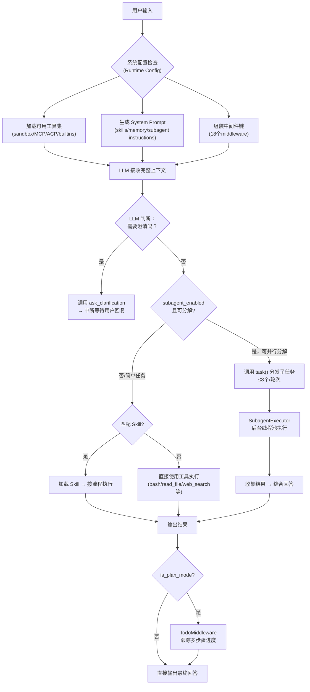

# Agent 任务执行判断机制

> 本文档描述 DeerFlow 中 Lead Agent 如何判断并执行一个用户任务，涵盖从请求输入到最终输出的完整决策链路。

---

## 概述

DeerFlow 的任务执行系统采用**三层协同决策模型**：

1. **运行时配置层**（Runtime Configuration）：定义 Agent 的能力边界
2. **系统提示层**（System Prompt）：引导 LLM 的决策行为
3. **工具可用性层**（Tool Availability）：决定 Agent 能"看到"哪些工具

这三个层面共同作用，形成从用户输入到最终输出的完整决策链路。

---

## 一、运行时配置层

Agent 在初始化时通过 `RunnableConfig` 获取配置，这些配置直接决定了 Agent 的能力边界。

### 关键配置项

| 配置项 | 默认值 | 作用 |
|--------|--------|------|
| `thinking_enabled` | `True` | 是否启用深度思考模式 |
| `reasoning_effort` | `None` | 推理努力程度（传递给 LLM） |
| `model_name` / `model` | `None` | 指定使用的 LLM 模型 |
| `is_plan_mode` | `False` | 是否启用 TodoList 中间件进行多步骤任务规划 |
| `subagent_enabled` | `False` | 是否启用子代理（Subagent）进行任务分解和并行执行 |
| `max_concurrent_subagents` | `3` | 每轮次最多并发的子代理数量 |
| `is_bootstrap` | `False` | 是否为引导模式（用于系统初始化） |
| `agent_name` | `"deerflow"` | Agent 身份标识，影响可用工具组和 Skill |

### 配置来源

配置通过以下方式传递：

1. **前端请求参数**：用户在 UI 中勾选的功能开关（如 "Use Sub-agents"）
2. **MCP 工具调用**：`invoke_agent` 调用时传入的 `config` 字段
3. **默认值兜底**：未传参数时使用代码中的默认值

```python
# backend/packages/harness/deerflow/agents/lead_agent/agent.py
def make_lead_agent(config: RunnableConfig):
    cfg = config.get("configurable", {})
    subagent_enabled = cfg.get("subagent_enabled", False)
    is_plan_mode = cfg.get("is_plan_mode", False)
    # ...
```

---

## 二、系统提示层

这是 Agent 决策的核心。通过精心设计的 System Prompt 引导 LLM 在每一步做出正确判断。

### 2.1 澄清优先（Clarification First）

Agent 必须在执行任何操作之前，先判断请求是否清晰。如果有任何模糊、缺失或多义的地方，**必须先调用 `ask_clarification` 工具**，而不是直接猜测执行。

**决策优先级**：

```
CLARIFY → PLAN → ACT
```

**判断标准**：

- 请求中存在不明确的目标或范围
- 缺少完成任务所需的必要信息
- 同一请求存在多种合理的理解方式
- 用户意图与字面表达不一致

**实现方式**：

系统提示中包含 `<thinking_style>` 和 `<clarification_system>` 指令，强制 LLM 在首次调用工具前进行自我审视：

```xml
<thinking_style>
- Think concisely and strategically about the user's request BEFORE taking action
- Break down the task: What is clear? What is ambiguous? What is missing?
- **PRIORITY CHECK: If anything is unclear, missing, or has multiple 
    interpretations, you MUST ask for clarification FIRST**
</thinking_style>
```

### 2.2 子代理分解策略（Subagent Decomposition）

当 `subagent_enabled=True` 时，系统提示会注入 `<subagent_system>` 指令，引导 LLM 判断是否需要将任务分解为多个子任务并行执行。

#### 应使用子代理的场景

- **复杂研究问题**：需要从多个信息源获取信息
- **多维度分析**：任务包含多个独立可并行的维度
- **大规模代码库分析**：需要同时分析不同文件或模块

#### 不应使用子代理的场景

- **任务无法分解**：无法拆分为 2 个及以上有意义的并行子任务
- **超简单操作**：读取单个文件、快速编辑、执行单条命令
- **强顺序依赖**：后一步骤依赖前一步骤的结果

#### 工作流程

```
DECOMPOSE → DELEGATE → SYNTHESIZE
```

1. **分解**：将复杂任务拆分为可并行的子任务
2. **委派**：同时调用多个 `task()` 工具分发子任务（每轮最多 3 个）
3. **综合**：收集子代理结果，整合为连贯的最终回答

### 2.3 Skill 匹配机制

当用户请求匹配某个 Skill 的适用场景时，Agent 会加载并遵循该 Skill 的工作流：

**渐进式加载模式**：

1. **匹配阶段**：用户查询匹配到某个 Skill 的适用场景
2. **加载阶段**：调用 `read_file` 读取 Skill 的主文件
3. **理解阶段**：阅读并理解 Skill 的工作流和指令
4. **按需加载**：仅在执行过程中加载 Skill 引用的其他资源
5. **严格执行**：按照 Skill 的指令精确执行

---

## 三、工具可用性层

Agent 在每次交互时都会看到一组可用的工具，这组工具直接决定了 Agent 的执行路径选择。

### 3.1 工具加载顺序

```python
# backend/packages/harness/deerflow/tools/tools.py
def get_available_tools(...) -> list[BaseTool]:
    tools = []
    # 1. 沙盒工具（bash, ls, read_file, write_file, str_replace）
    tools.extend(get_sandbox_tools(...))
    # 2. 内置工具（present_files, ask_clarification）
    tools.extend(get_builtin_tools(...))
    # 3. 视觉工具（view_image，仅当模型支持视觉时）
    tools.extend(get_vision_tools(...))
    # 4. 子代理工具（task，仅当 subagent_enabled 时）
    tools.extend(get_subagent_tools(...))
    # 5. MCP 工具（来自 extensions_config.json）
    tools.extend(get_mcp_tools(...))
    # 6. ACP Agent 工具（invoke_acp_agent）
    tools.extend(get_acp_tools(...))
    # 7. Skill 进化工具（仅当 skill_evolution 开启时）
    tools.extend(get_skill_tools(...))
    return tools
```

### 3.2 工具对决策的影响

Agent 只能"看到"被加载的工具，因此：

- 如果 `subagent_enabled=False`，Agent 看不到 `task` 工具，不会尝试分解任务
- 如果未配置 MCP，Agent 看不到外部工具，只能使用沙盒内置工具
- 如果 `skill_evolution=False`，Agent 看不到 Skill 管理工具

---

## 四、中间件链（Middleware Chain）

Agent 的执行被 18 个中间件组成的链条包裹，负责执行保障：

| 中间件 | 职责 |
|--------|------|
| **Retry Middleware** | 处理工具调用失败的重试 |
| **Loop Detection** | 检测并防止无限循环 |
| **Token Management** | 管理上下文窗口，防止超限 |
| **Concurrency Limit** | 限制并发工具调用数量 |
| **Todo Middleware**（Plan Mode） | 跟踪多步骤任务的执行进度 |
| **Rate Limiting** | 控制请求频率 |
| **Error Recovery** | 统一错误处理和恢复策略 |

中间件链在 Agent 初始化时组装：

```python
# backend/packages/harness/deerflow/agents/lead_agent/agent.py
agent = llm_agent_builder.compile(
    name=name,
    tools=tools,
    state_schema=AgentState,
    checkpointer=checkpointer,
    store=store,
    interrupt_before=interrupt_before,
    interrupt_after=interrupt_after,
    debug=debug,
)
```

---

## 五、完整决策流程



### 关键决策点说明

1. **澄清检查（黄色）**：这是第一道关口。如果 LLM 判断请求有歧义，会立即中断并询问用户
2. **子代理判断（黄色）**：如果任务可分解为并行的子任务，且配置允许，LLM 会调用 `task` 工具
3. **Skill 匹配（黄色）**：如果请求匹配已知的 Skill 场景，LLM 会加载并遵循 Skill 流程
4. **计划模式（黄色）**：如果开启了 Plan Mode，输出会经过 TodoMiddleware 进行进度跟踪

---

## 六、各执行路径详解

### 6.1 路径 A：澄清请求

**触发条件**：请求存在歧义或缺少必要信息。

**执行流程**：

1. LLM 分析请求，识别模糊点
2. 调用 `ask_clarification` 工具
3. 工具返回中断信号，前端显示澄清问题
4. 用户回复后，重新进入决策流程

**示例**：

```
用户：帮我优化代码
Agent：您希望优化哪段代码？请提供文件路径或代码片段。
```

### 6.2 路径 B：子代理并行执行

**触发条件**：`subagent_enabled=True`，任务可分解为 ≥2 个并行子任务。

**执行流程**：

1. LLM 分解任务，生成子任务列表
2. 同时调用多个 `task()` 工具（≤3 个/轮次）
3. `SubagentExecutor` 在后台线程池中执行各子代理
4. 收集所有子代理结果
5. LLM 综合结果，生成最终回答

**示例**：

```
用户：分析这个项目的架构
Agent → task("分析目录结构") + task("分析依赖关系") + task("分析核心模块")
      → 综合三个子代理的分析结果 → 输出完整架构报告
```

### 6.3 路径 C：Skill 驱动执行

**触发条件**：请求匹配某个已加载 Skill 的适用场景。

**执行流程**：

1. LLM 识别匹配的 Skill
2. 调用 `read_file` 加载 Skill 主文件
3. 阅读 Skill 指令和工作流
4. 按 Skill 定义的步骤逐步执行

**示例**：

```
用户：创建一个前端组件
Agent → 加载 frontend-design Skill → 按 Skill 指令执行组件开发流程
```

### 6.4 路径 D：直接工具执行

**触发条件**：简单任务，无需分解，无匹配 Skill。

**执行流程**：

1. LLM 直接选择最合适的工具
2. 调用工具并获取结果
3. 根据结果判断是否需要进一步操作
4. 输出最终结果

**示例**：

```
用户：读取 /etc/hosts 文件
Agent → 调用 read_file("/etc/hosts") → 直接返回文件内容
```

---

## 七、配置与行为的映射关系

| 配置组合 | 行为特征 |
|----------|----------|
| `subagent_enabled=False`, `is_plan_mode=False` | 单 Agent 模式，适合简单问答和工具调用 |
| `subagent_enabled=True`, `is_plan_mode=False` | 可分解任务并行执行，但不跟踪进度 |
| `subagent_enabled=False`, `is_plan_mode=True` | 单 Agent 顺序执行，有 TodoList 进度跟踪 |
| `subagent_enabled=True`, `is_plan_mode=True` | 完整模式：任务分解 + 并行执行 + 进度跟踪 |
| `thinking_enabled=False` | 减少推理步骤，响应更快但可能不够深入 |
| 自定义 `agent_name` | 加载特定的工具组和 Skill 配置 |

---

## 八、相关文件

| 文件 | 职责 |
|------|------|
| `backend/packages/harness/deerflow/agents/lead_agent/agent.py` | Lead Agent 初始化、配置解析、工具加载 |
| `backend/packages/harness/deerflow/agents/lead_agent/prompt.py` | System Prompt 生成，包含所有决策指令 |
| `backend/packages/harness/deerflow/tools/tools.py` | 工具发现与加载逻辑 |
| `backend/packages/harness/deerflow/subagents/executor.py` | 子代理执行器，管理并行子任务 |
| `backend/packages/harness/deerflow/tools/__init__.py` | 工具注册和初始化 |

---

## 九、设计原则

1. **LLM 自主决策，多层约束**：Agent 的核心决策由 LLM 自主完成，但通过配置、提示词、工具三层机制进行约束和引导。

2. **渐进式能力暴露**：复杂能力（如子代理、计划模式）默认关闭，需要用户显式开启，避免过度复杂化简单任务。

3. **安全优先**：中间件链提供循环检测、Token 管理、错误恢复等多重保障，确保执行过程安全可控。

4. **用户意图优先**：澄清机制确保 Agent 不会误解用户意图，避免在错误的方向上执行。
